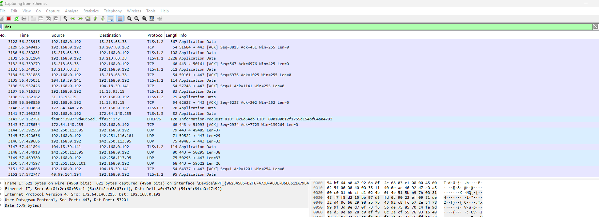
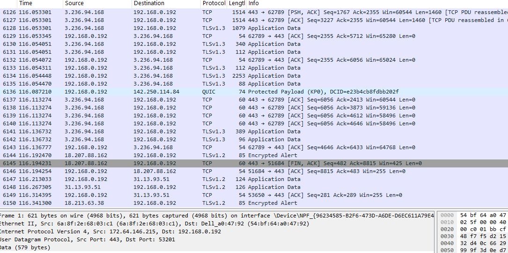

🔧 Setup

Tool: Wireshark (with Npcap driver installed)

System: Windows 11 Desktop

Interfaces: Wi-Fi & Ethernet

📡 Captures
1. DNS Lookups

Filter used:

dns

Captured DNS queries and responses while browsing.

✅ Confirms ability to isolate name resolution traffic.

📸 Screenshot – DNS Queries

2. ICMP Ping Test

Filter used:

Sent ping requests to Google DNS server (8.8.8.8).

✅ Shows echo request/reply workflow.

📸 Screenshot – ICMP Ping

3. ICMP Ping Flood (Noisy Traffic Simulation)

Command used:

ping 8.8.8.8 -t

Generated continuous ICMP packets to simulate suspicious traffic.

✅ Demonstrates anomaly detection (DoS-like behavior).

📸 Screenshot – ICMP Ping Flood
ping-t.png

4. Encrypted Traffic (YouTube Streaming)

Filter used:

tls

or

quic

Captured QUIC/TLS packets while streaming YouTube.

✅ Shows encrypted traffic for modern applications.

📸 Screenshot – YouTube Traffic
youtube-traffic.png

🌐 Bonus: Multi-Interface Comparison

Performed captures on Wi-Fi and Ethernet.

✅ Showed differences in IP addresses and traffic patterns.

📸 Screenshot – Ethernet Capture
ethernet-capture.png

📊 Lessons Learned

How to apply filters for DNS, ICMP, TLS, and QUIC.

How to simulate both normal and suspicious traffic patterns.

Why establishing a baseline is important before detecting anomalies.

Key differences between Wi-Fi and Ethernet captures.

✅ Skills Demonstrated

Network protocol analysis (DNS, ICMP, TLS, QUIC)

Anomaly detection in packet captures

Practical use of Wireshark filters

Documentation of findings with screenshots

👉 All you need to do is upload your screenshots into your repo’s /images/ folder and rename them to match the references here (dns-filter.png, ping.png, ping-t.png, youtube-traffic.png, ethernet-capture.png).

Do you want me to also prep a .zip structure for you (README + /images/ placeholders) so you can just drag and drop it into GitHub instead of setting up the folder paths manually again?

You said:
Sorry I meant the read me
ChatGPT said:

Got it 👍 — you meant you’d like me to regenerate the README.md file content for your Wireshark Network Analysis Lab project. Here’s the full README, clean and ready for you to copy-paste into README.md in your repo:

🦈 Wireshark Network Analysis Lab
📌 Overview

This project demonstrates how to capture, filter, and analyze different types of network traffic using Wireshark. The objective is to establish a baseline of normal activity, apply filters to isolate protocols, and simulate suspicious traffic patterns that a SOC analyst might investigate.

🔧 Setup

Tool: Wireshark (with Npcap driver installed)

System: Windows 11 Desktop

Interfaces: Wi-Fi & Ethernet

📡 Captures
1. DNS Lookups

Filter used:

dns

Captured DNS queries and responses while browsing.

✅ Confirms ability to isolate name resolution traffic.

📸 Screenshot – DNS Queries

2. ICMP Ping Test

Filter used:

icmp

Sent ping requests to Google DNS server (8.8.8.8).

✅ Shows echo request/reply workflow.

📸 Screenshot – ICMP Ping

3. ICMP Ping Flood (Noisy Traffic Simulation)

Command used:

ping 8.8.8.8 -t

Generated continuous ICMP packets to simulate suspicious traffic.

✅ Demonstrates anomaly detection (DoS-like behavior).

📸 Screenshot – ICMP Ping Flood

4. Encrypted Traffic (YouTube Streaming)

Filters used:

tls

or

quic

Captured QUIC/TLS packets while streaming YouTube.

✅ Shows encrypted traffic for modern applications.

📸 Screenshot – YouTube Traffic

🌐 Bonus: Multi-Interface Comparison

Performed captures on Wi-Fi and Ethernet.

✅ Showed differences in IP addresses and traffic patterns.

📸 Screenshot – Ethernet Capture

📊 Lessons Learned

How to apply filters for DNS, ICMP, TLS, and QUIC.

How to simulate both normal and suspicious traffic patterns.

Why establishing a baseline is important before detecting anomalies.

Key differences between Wi-Fi and Ethernet captures.

✅ Skills Demonstrated

Network protocol analysis (DNS, ICMP, TLS, QUIC)

Anomaly detection in packet captures

Practical use of Wireshark filters

Documentation of findings with screenshots
