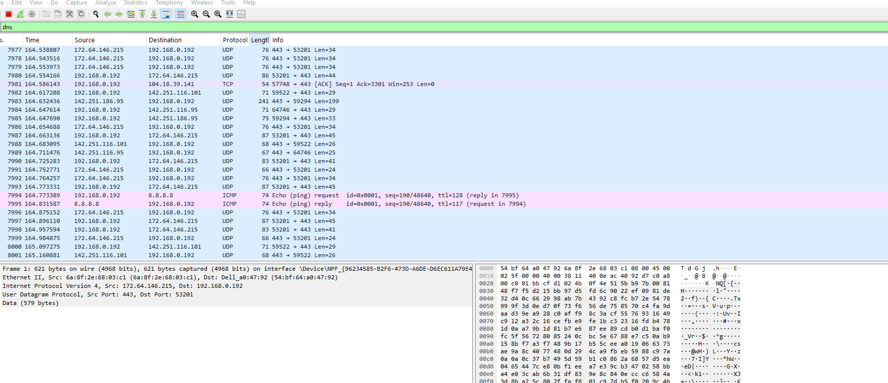
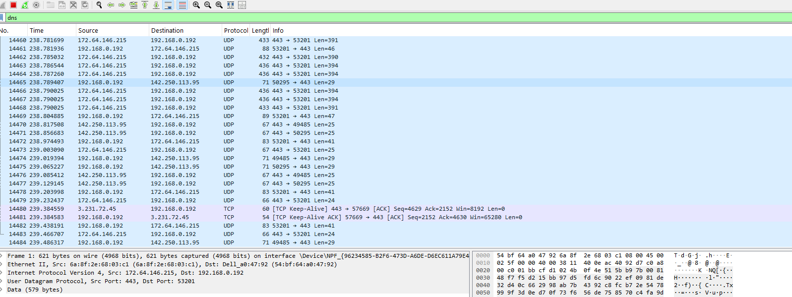
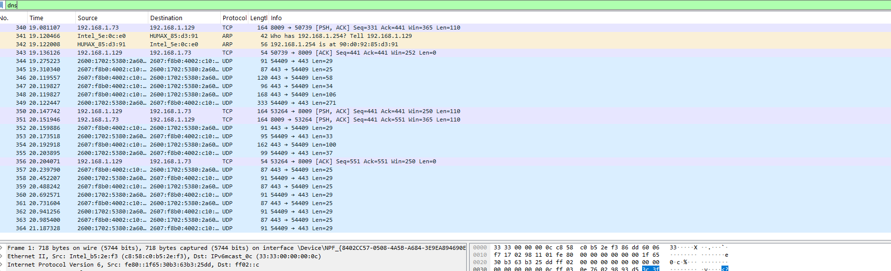
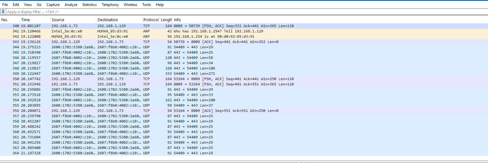

🔧 Setup

Tool: Wireshark (with Npcap driver installed)

System: Windows 11 Desktop

Interfaces: Wi-Fi & Ethernet

📡 Captures
1. DNS Lookups

Filter used:

dns

Captured DNS queries and responses while browsing.

✅ Confirms ability to isolate name resolution traffic.

📸 Screenshot – DNS Queries

2. ICMP Ping Test

Filter used:

Sent ping requests to Google DNS server (8.8.8.8).

✅ Shows echo request/reply workflow.

📸 Screenshot – ICMP Ping

3. ICMP Ping Flood (Noisy Traffic Simulation)

Command used:

ping 8.8.8.8 -t

Generated continuous ICMP packets to simulate suspicious traffic.

✅ Demonstrates anomaly detection (DoS-like behavior).

📸 Screenshot – ICMP Ping Flood

4. Encrypted Traffic (YouTube Streaming)

Filter used:

tls

or

quic

Captured QUIC/TLS packets while streaming YouTube.

✅ Shows encrypted traffic for modern applications.

📸 Screenshot – YouTube Traffic

🌐 Bonus: Multi-Interface Comparison

Performed captures on Wi-Fi and Ethernet.

✅ Showed differences in IP addresses and traffic patterns.

📸 Screenshot – Ethernet Capture

📊 Lessons Learned

How to apply filters for DNS, ICMP, TLS, and QUIC.

How to simulate both normal and suspicious traffic patterns.

Why establishing a baseline is important before detecting anomalies.

Key differences between Wi-Fi and Ethernet captures.

✅ Skills Demonstrated

Network protocol analysis (DNS, ICMP, TLS, QUIC)

Anomaly detection in packet captures

Practical use of Wireshark filters

Documentation of findings with screenshots

This project demonstrates how to capture, filter, and analyze different types of network traffic using Wireshark. The objective is to establish a baseline of normal activity, apply filters to isolate protocols, and simulate suspicious traffic patterns that a SOC analyst might investigate.

🔧 Setup

Tool: Wireshark (with Npcap driver installed)

System: Windows 11 Desktop

🌐 Bonus: Multi-Interface Comparison

Performed captures on Wi-Fi and Ethernet.

✅ Showed differences in IP addresses and traffic patterns.

📸 Screenshot – wifi Capture

📊 Lessons Learned

How to apply filters for DNS, ICMP, TLS, and QUIC.

How to simulate both normal and suspicious traffic patterns.

Why establishing a baseline is important before detecting anomalies.

Key differences between Wi-Fi and Ethernet captures.

✅ Skills Demonstrated

Network protocol analysis (DNS, ICMP, TLS, QUIC)

Anomaly detection in packet captures

Practical use of Wireshark filters

Documentation of findings with screenshots
